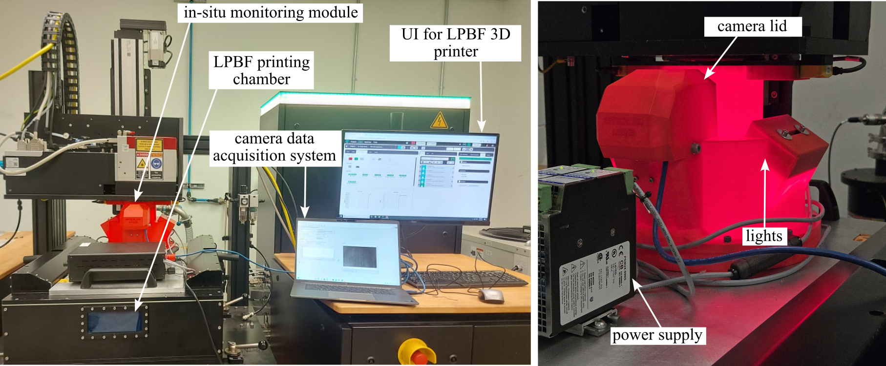

# LPBF-Observer
Hardware and software designs for in situ systems for laser-based powder bed fusion additive manufacturing.

   
The laser vibrometer setup of in situ systems for laser-based powder bed fusion additive manufacturing.  

## [System Development](system_development)
The system (hardware and software) design for the project.

## [General Use](general_use)
Basic accessories for the system that can be used with any of the covers.

## Licensing and Citation

This work is licensed under a Creative Commons Attribution-ShareAlike 4.0 International License [cc-by-sa 4.0].

#### Bibtex

@Misc{ARTSLabSituMonitoringPowder,  
  author = {{ARTS-L}ab},  
  title  = {{LPBF}-Observer},  
  groups = {{ARTS-L}ab},  
  note = {Accessed: 20xx-xx-xx},  
  url    = {https://github.com/ARTS-Laboratory/LPBF-Observer},  
}  

QR code for repo.

