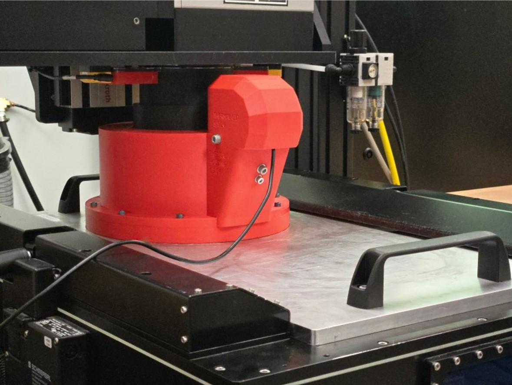
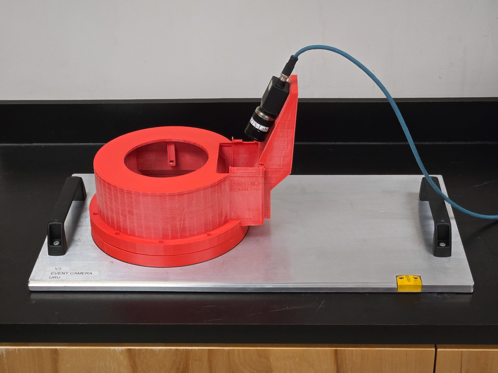
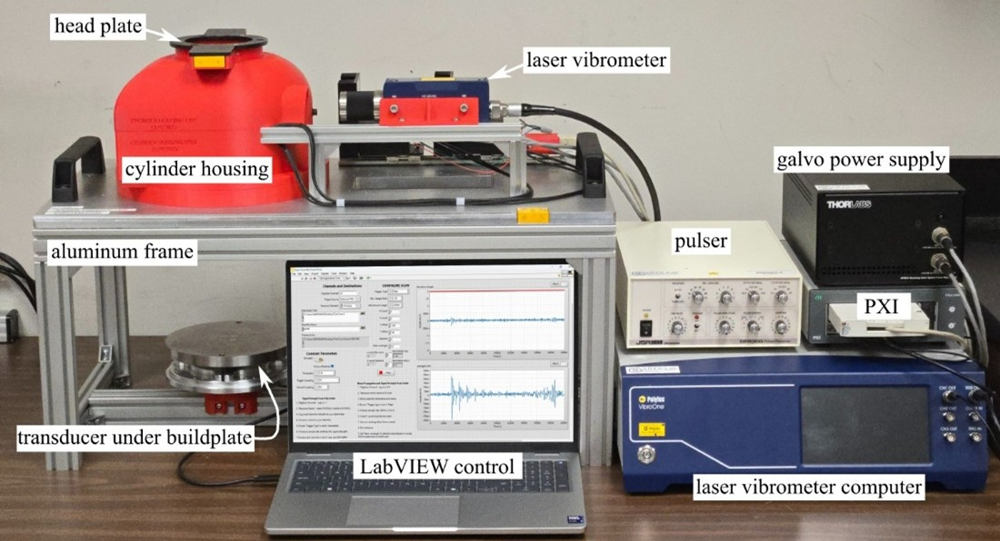
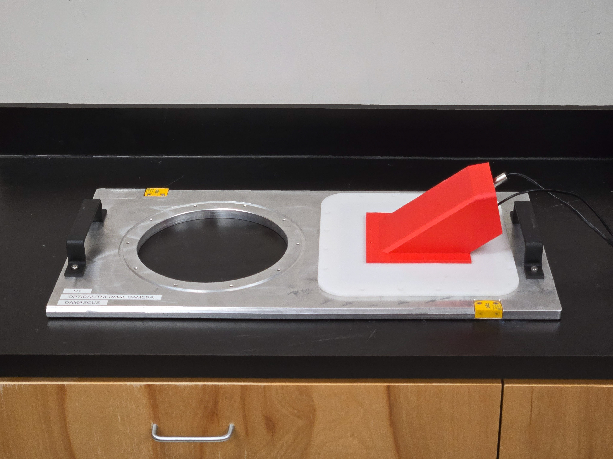

# Systems Variations  
Different system variations (i.e., product lines) are named after cities historically known for metalworking and steel production.  

## [Birmingham](Birmingham)
* Birmingham, Alabama, USA — a major center of iron and steel production during the Industrial Revolution, often called the “Pittsburgh of the South.”
* Sensing system designed with an optical camera.

   
Custom cover with an integrated optical camera mount for laser-based powder bed fusion additive manufacturing monitoring. Camera not yet installed.

## [Pittsburgh](Pittsburgh)
* Pittsburgh, Pennsylvania, USA — a historic hub of large-scale steel manufacturing, central to modern industrial development.
* Sensing system designed with a thermal camera.

   
Custom cover with an integrated thermal camera mount for laser-based powder bed fusion additive manufacturing monitoring. 

## [Turin](Turin)
* Turin, Italy — an important industrial city closely tied to automotive manufacturing and advanced metalworking.
* Sensing system designed with an event camera.

   
Custom cover with event camera mount for in-situ monitoring of laser-based powder bed fusion processes.

## [Sheffield](Sheffield)
* Sheffield, England, United Kingdom — a world-renowned center for steel production, known for crucible and stainless steel innovations.
* Sensing system designed with a laser vibrometer.

   
Experimental setup including custom cover assembly, laser vibrometer, piezoelectric transducer, and pulser. 

## [Damascus](Damascus)
* Damascus, Syria — historically associated with high-quality patterned steel, known for its strength and distinctive appearance.
* Sensing system designed with multiple sensing systems.

   
Integrated dual vision holder securely mounts a thermal camera and an optical camera for synchronized data acquisition on a custom cover. 

