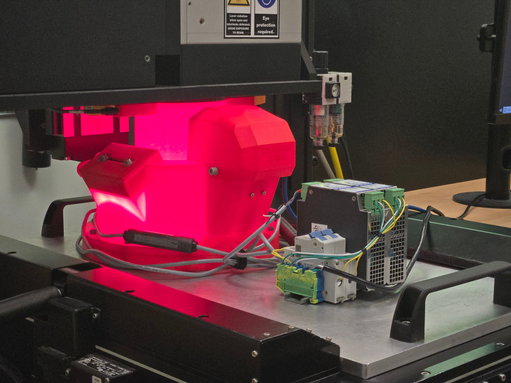

# Deperacated Systems Variations  
Deperacted system variations that are still useful, but not acitivly developed. 

## [Birmingham](Birmingham)
* Birmingham, Alabama, USA — a major center of iron and steel production during the Industrial Revolution, often called the “Pittsburgh of the South.”
* Sensing system designed with an optical camera.

   
Custom cover with an integrated optical camera mount for laser-based powder bed fusion additive manufacturing monitoring. Camera not yet installed.

## [Pittsburgh](Pittsburgh)
* Pittsburgh, Pennsylvania, USA — a historic hub of large-scale steel manufacturing, central to modern industrial development.
* Sensing system designed with a thermal camera.

   
Custom cover with an integrated thermal camera mount for laser-based powder bed fusion additive manufacturing monitoring. 

## [Turin](Turin)
* Turin, Italy — an important industrial city closely tied to automotive manufacturing and advanced metalworking.
* Sensing system designed with an event camera.

   
Custom cover with event camera mount for in-situ monitoring of laser-based powder bed fusion processes.

